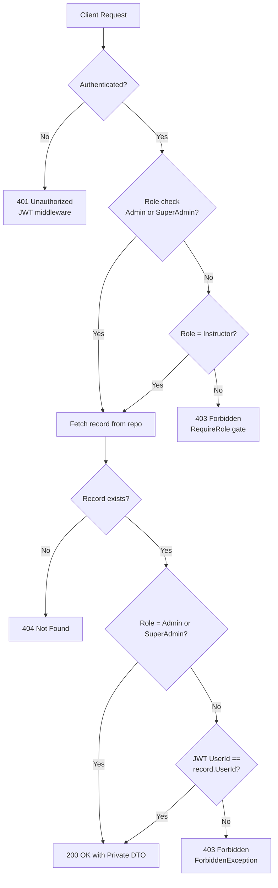

# Design Document: Instructor Private Response Visibility

## Overview

This feature restricts `GET /instructors/private/{id}` so that only three categories of callers can receive a 200 response:

1. Users with the `Admin` role (regardless of ownership)
2. Users with the `SuperAdmin` role (regardless of ownership)
3. Users with the `Instructor` role whose `UserId` JWT claim matches the `UserId` stored on the requested `Instructor` record (i.e., the **owner**)

All other authenticated users (`Instructor` non-owners, `Student`) receive HTTP 403. Unauthenticated requests receive HTTP 401. Requests for non-existent records receive HTTP 404.

The primary design goal is to keep the change minimal and consistent with the codebase's existing authorization pattern: `ForbiddenException` is thrown by application-layer code and converted to a 403 by the registered `ForbiddenExceptionHandler`. No new ASP.NET Core `IAuthorizationHandler` or named policy infrastructure is needed; the ownership gate is enforced in the endpoint delegate itself, immediately after the repository fetch, before returning data.

---

## Architecture

### Authorization Flow



### Key Design Decisions

**Ownership check in the endpoint handler, not a MediatR behavior**

The existing `InstructorOwnershipBehavior` handles resource ownership for write operations (courses, sections, content) via the `IInstructorOwnedRequest` marker interface. Reusing it here would require fetching the record twice (once in the behavior, once in the query handler) or restructuring the query result. Instead, the ownership check is placed directly in the `GetPrivateInstructor` endpoint delegate: fetch the record first, then compare `record.UserId` against the `UserId` claim from `ICurrentUserService`. This is one network round trip and keeps the query handler simple.

**`RequireAuthorization` policy updated to include `SuperAdmin`**

The current inline policy restricts to `Instructor | Admin`. This is replaced with `Instructor | Admin | SuperAdmin`. The `SuperAdmin` check then passes the ownership gate automatically because the role branch short-circuits before the ownership comparison.

**`ForbiddenException` for the ownership gate**

The existing `ForbiddenExceptionHandler` converts any thrown `ForbiddenException` to a structured 403 ProblemDetails response. Throwing `ForbiddenException` in the endpoint delegate is consistent with how the rest of the codebase signals 403 conditions.

**404 before ownership check**

The record is fetched from the repository before ownership is evaluated. If the record does not exist, a 404 is returned regardless of who is asking — this prevents user enumeration and aligns with requirement 2.3.

---

## Components and Interfaces

### Modified: `InstructorsEndpoints.GetPrivateInstructor`

The delegate signature expands to accept `ICurrentUserService` and `ClaimsPrincipal` (via `HttpContext.User`). The role-based gate on the route is changed, and ownership logic is added inline.

```csharp
// File: API/API/Endpoints/InstructorsEndpoints.cs

group.MapGet("/private/{id:guid}", GetPrivateInstructor)
    .WithName(nameof(GetPrivateInstructor))
    .Produces<InstructorPrivateResponseDto>(StatusCodes.Status200OK)
    .Produces(StatusCodes.Status401Unauthorized)
    .Produces(StatusCodes.Status403Forbidden)
    .Produces(StatusCodes.Status404NotFound)
    .RequireAuthorization(policy =>
        policy.RequireRole(
            Role.Instructor.ToString(),
            Role.Admin.ToString(),
            Role.SuperAdmin.ToString()));

// Delegate:
public static async Task<Results<Ok<InstructorPrivateResponseDto>, NotFound>> GetPrivateInstructor(
    Guid id,
    IMediator mediator,
    ICurrentUserService currentUserService,
    ClaimsPrincipal user)
{
    var result = await mediator.Send(new GetPrivateInstructorByIdQuery(id));
    if (result is null)
        return TypedResults.NotFound();

    // Admins and SuperAdmins bypass ownership check
    if (user.IsInRole(Role.Admin.ToString()) || user.IsInRole(Role.SuperAdmin.ToString()))
        return TypedResults.Ok(result);

    // Instructor role: enforce ownership
    if (currentUserService.UserId != result.UserId)
        throw new ForbiddenException("You are not authorized to view this instructor's private profile.");

    return TypedResults.Ok(result);
}
```

### Modified: `InstructorPrivateResponseDto`

A `UserId` property must be exposed on the DTO so the endpoint delegate can compare it with the JWT claim without an extra repository call. This field is **not** added to `InstructorCommonResponseDto` — it stays private-DTO-only.

```csharp
// File: Application/DTOs/Instructor/InstructorPrivateResponseDto.cs

public class InstructorPrivateResponseDto : InstructorCommonResponseDto
{
    public string UserId { get; set; } = string.Empty;  // used for ownership check only
    public string PhoneNumber { get; set; } = string.Empty;
    public string CvUrl { get; set; } = string.Empty;
}
```

### Unchanged: `GetPrivateInstructorByIdQueryHandler`

The query handler stays as-is — it calls `_repo.GetPrivateByIdAsync(request.Id)` and returns the DTO. The authorization concern is deliberately kept out of the application layer.

### Unchanged: `ICurrentUserService`

Already provides `UserId` (the `NameIdentifier` claim string) and `IsAuthenticated`. No changes needed.

### Unchanged: `ForbiddenException` / `ForbiddenExceptionHandler`

The handler already converts any `ForbiddenException` to a 403 ProblemDetails response. Reused without modification.

---

## Data Models

### DTO Hierarchy

```
BaseResponseDto
  └── BaseUserResponseDto          (Id, FirstName, LastName, Email, UserName, ProfilePicture, Gender)
        └── InstructorCommonResponseDto  (Bio, Title, LinkedInProfileUrl, GitHubProfileUrl, Status)
              ├── InstructorPublicResponseDto   (no sensitive fields)
              └── InstructorPrivateResponseDto  (UserId, PhoneNumber, CvUrl)
```

- `InstructorPublicResponseDto` — returned by `GET /instructors/public/{id}`. Never contains `PhoneNumber`, `CvUrl`, or `UserId`.
- `InstructorPrivateResponseDto` — returned only by `GET /instructors/private/{id}` on authorized requests. Contains `UserId` (for ownership comparison in the endpoint), `PhoneNumber`, and `CvUrl`.

### `Instructor` Entity (unchanged)

| Field | Type | Notes |
|---|---|---|
| `Id` | `Guid` | Primary key (route parameter) |
| `UserId` | `string` | FK to `ApplicationUser.Id` — the ownership anchor |
| `Bio`, `Title`, `LinkedInProfileUrl`, `GitHubProfileUrl` | `string` | Common fields |
| `CvUrl` | `string` | Sensitive — private DTO only |
| `Status` | `InstructorStatus` | Common fields |

The `UserId` on the entity is the value mapped into `InstructorPrivateResponseDto.UserId`. The JWT claim `NameIdentifier` stored in `ICurrentUserService.UserId` is compared against this value to determine ownership.

### Repository: `IInstructorRepository.GetPrivateByIdAsync`

Returns `InstructorPrivateResponseDto?` — the repository mapping must include `UserId` in the projection. The existing signature is unchanged; the mapping layer must be updated to populate `UserId`.

```csharp
// Mapping must include:
UserId = instructor.UserId
```

---

## Correctness Properties

*A property is a characteristic or behavior that should hold true across all valid executions of a system — essentially, a formal statement about what the system should do. Properties serve as the bridge between human-readable specifications and machine-verifiable correctness guarantees.*

### Property 1: Admin and SuperAdmin always receive the private DTO

*For any* valid instructor record and any requesting user whose role is `Admin` or `SuperAdmin`, the endpoint SHALL return HTTP 200 with a response body containing all fields of `InstructorPrivateResponseDto` (including `PhoneNumber` and `CvUrl`), regardless of whether that user owns the record.

**Validates: Requirements 1.1, 1.2, 1.7**

---

### Property 2: Owner receives the private DTO

*For any* valid instructor record and any requesting user whose `Instructor` role JWT `UserId` claim matches that record's `UserId`, the endpoint SHALL return HTTP 200 with a response body containing all fields of `InstructorPrivateResponseDto`.

**Validates: Requirements 1.3, 2.1, 4.2**

---

### Property 3: Non-owner instructor always receives 403

*For any* valid instructor record and any requesting user with the `Instructor` role whose JWT `UserId` claim does NOT match that record's `UserId`, the endpoint SHALL return HTTP 403 and the response body SHALL NOT contain `PhoneNumber` or `CvUrl`.

**Validates: Requirements 1.4, 2.2**

---

### Property 4: Student always receives 403

*For any* valid instructor record and any requesting user with only the `Student` role, the endpoint SHALL return HTTP 403.

**Validates: Requirements 1.5**

---

### Property 5: Unauthenticated requests always receive 401

*For any* valid instructor record, a request with no valid JWT token SHALL receive HTTP 401.

**Validates: Requirements 1.6**

---

### Property 6: Non-existent record returns 404 for any caller

*For any* requesting user (regardless of role, including Admin and SuperAdmin) and any record id that does not exist in the data store, the endpoint SHALL return HTTP 404.

**Validates: Requirements 2.3**

---

### Property 7: Public endpoint never leaks private fields

*For any* instructor record and any requesting user (regardless of role or authentication state), the response body of `GET /instructors/public/{id}` SHALL NOT contain a `PhoneNumber` or `CvUrl` field.

**Validates: Requirements 3.1, 3.2**

---

## Error Handling

| Scenario | HTTP Status | Mechanism |
|---|---|---|
| No `Authorization` header / invalid JWT | 401 | JWT Bearer middleware challenge |
| Authenticated but role not in allowed set | 403 | ASP.NET Core `RequireRole` policy |
| Authenticated, correct role, non-owner instructor | 403 | `ForbiddenException` thrown in endpoint delegate → `ForbiddenExceptionHandler` |
| Record does not exist | 404 | `TypedResults.NotFound()` returned in endpoint delegate |
| Permitted caller, record exists | 200 | `TypedResults.Ok(result)` |

All error responses are formatted as RFC 7807 ProblemDetails via the registered `IProblemDetailsService`.

---

## Testing Strategy

### Unit Tests

These cover specific examples and error conditions that are fast to assert and don't require property generators:

- Admin role → 200 (any instructor record)
- SuperAdmin role → 200 (any instructor record)
- Instructor role + matching `UserId` → 200
- Instructor role + non-matching `UserId` → `ForbiddenException` thrown
- Student role → blocked by `RequireRole` (returns 403)
- Unauthenticated → JWT middleware returns 401
- Record not found → 404 before any role/ownership check
- Admin who is also an Instructor → 200 (role takes precedence)
- `InstructorPrivateResponseDto` serialization does not include fields from `InstructorPublicResponseDto`

### Property-Based Tests

The codebase is C#. The property-based testing library to use is [**FsCheck**](https://fscheck.github.io/FsCheck/) (integrates cleanly with xUnit, widely used in .NET).

Each property test must run a minimum of **100 iterations**.

Tag format in test code:
```
// Feature: instructor-private-response-visibility, Property {N}: {property_text}
```

| Property | Test description | Varied inputs |
|---|---|---|
| P1 | Admin/SuperAdmin always allowed | Random `InstructorPrivateResponseDto` instances with random `UserId`s; random requesting user with `Admin` or `SuperAdmin` role |
| P2 | Owner always allowed | Random instructor records; requesting user `UserId` set equal to record `UserId` |
| P3 | Non-owner instructor always 403 | Random instructor records; requesting user `UserId` guaranteed ≠ record `UserId` |
| P6 | Missing record → 404 for any caller | Random roles (including Admin); random non-existent GUIDs |
| P7 | Public endpoint never leaks private fields | Random `InstructorPublicResponseDto` instances; verify no `PhoneNumber`/`CvUrl` property in serialized JSON |

Properties P4 (Student) and P5 (Unauthenticated) are best covered as example-based unit/integration tests because the role gate and JWT middleware are infrastructure concerns that don't vary meaningfully with input variation — 100 iterations would not find additional bugs over 2–3 examples.

### Integration Tests

- End-to-end HTTP tests confirming the correct status codes for each role × ownership combination
- Verify 401 without a token
- Verify 404 for a random non-existent GUID for an Admin caller (confirms 404 precedes role bypass)
